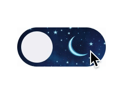
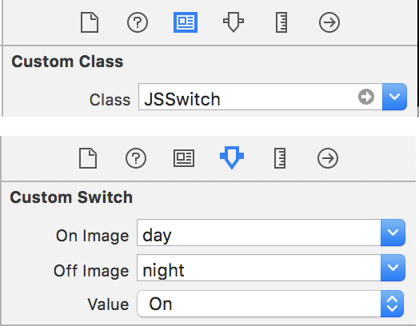
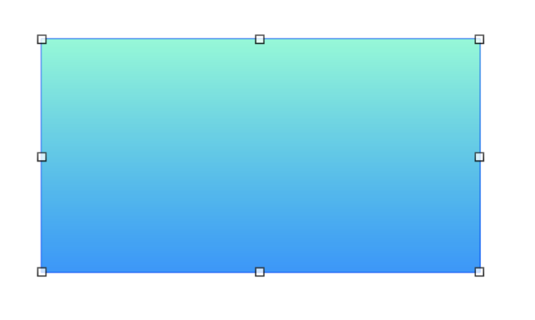
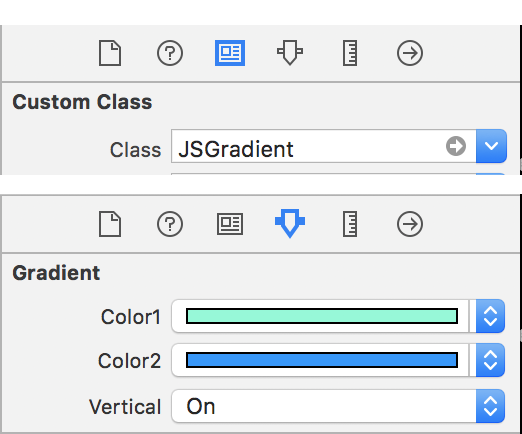

# JSCustom iOS Elements

[![Swift Version][swift-image]][swift-url]

Native customized iOS elements

#### Custom Switch
##### Credit to https://dribbble.com/shots/3547388-Bali-Explorer-App-Switches
  

#### Custom Gradient View
  

[swift-image]:https://img.shields.io/badge/swift-3.0-orange.svg
[swift-url]: https://swift.org/
